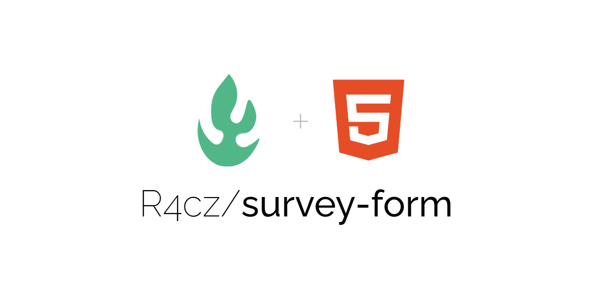
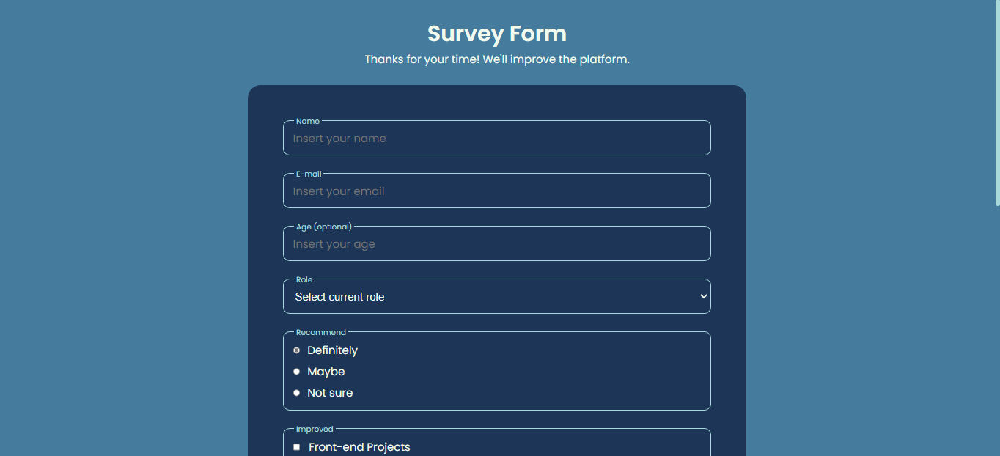
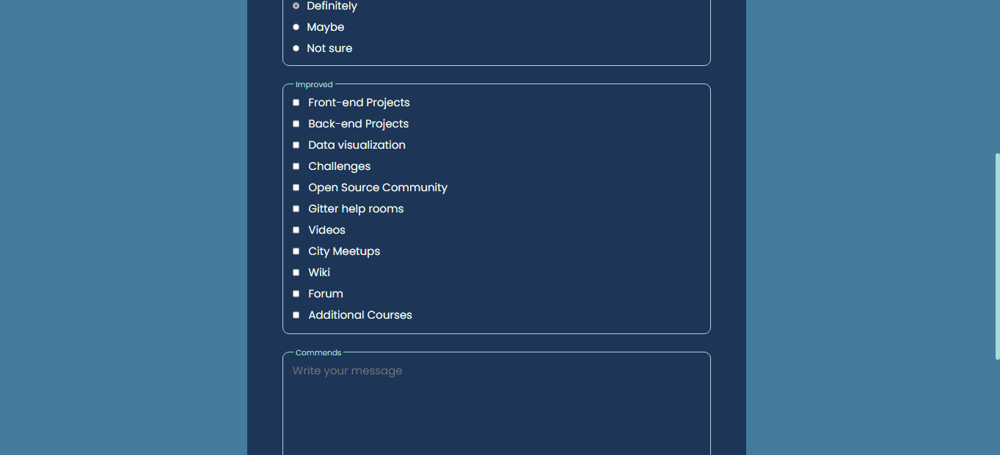
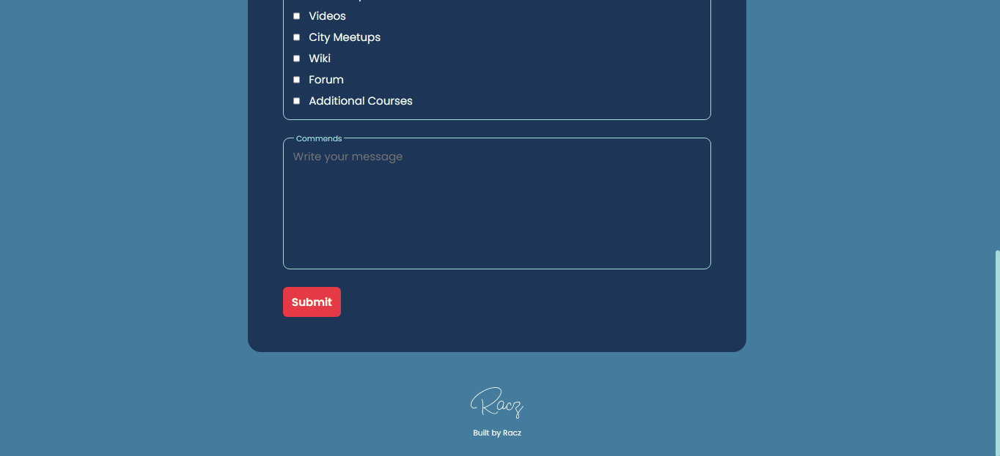
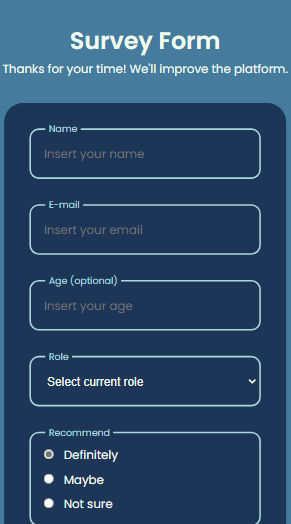
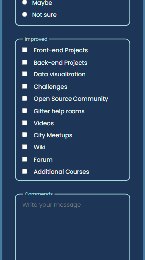
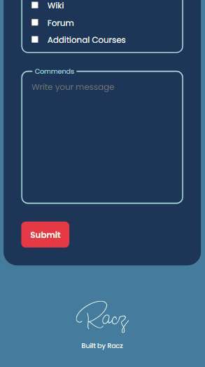

<h1 align="center" id="title">Survey Form</h1>

<p align="center"></p>

<p id="description">A responsive survey form.</p>

## Table of Contents

- [Demo](#demo)
- [Features](#features)
- [Installation Step](#installation-steps)
- [The process](#the-process)
  - [Built with](#built-with)
  - [Structure](#structure)
- [Useful resources](#useful-resources)
- [License](#license)
- [Author](#author)

## Demo







  
## Features

Here're some of the project's best features:

*   Adding inputs: dropdown, radio, checkbox, textarea.
*   Adding a submit button.

## Installation Steps:

1. Clone the repository.
2. Open the project with Visual Studio Code.
3. Run the form and enjoy it.

## The process 
### Built with

Technologies used in the project:

*   HTML5
*   CSS3
*   Visual Studio Code 1.70.2

### Structure

``` HTML
    <div class="contact__form--div modifier1">
      <label for="recommend" class="contact__form--tag">Recommend</label>

      <div class="contact__form--input">
        <div>
          <input type="radio" id="definitely" name="recommend" value="definitely" checked>
          <label for="definitely">Definitely</label>
        </div>

        <div>
          <input type="radio" id="maybe" name="recommend" value="maybe">
          <label for="maybe">Maybe</label>
        </div>

        <div>
          <input type="radio" id="not-sure" name="recommend" value="not-sure">
          <label for="not-sure">Not sure</label>
        </div>
      </div>
    </div>
```

## Useful resources

* [HTML](https://html.com/) - Code used to structure and display a web page and its contents.
* [CSS](https://www.w3.org/) - Graphic design language to define and create the presentation of a structured document written in a markup language.
* [Visual Studio Code](https://code.visualstudio.com/) - Source code editor developed by Microsoft.

## License:

> This project is licensed under the MIT License

## Author

Made with 💚 by [R4cz](https://www.linkedin.com/in/r4cz/)
